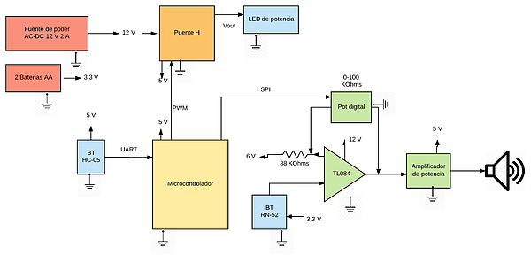

# Sensei

Sensei is a sleepin aid device. Lamp + speaker that will dimm gradually until going off while you fall asleep.
Control the volume of your music and light intensity of the lamp with an android companion app.
Setup the timer for turning off sensei at the time you will fall asleep.

## Website

Visit the website [here](https://lirivrod.wixsite.com/sensei)

## Communications.

You can connect via bluetooth to control sensei and to stream your music from your smartphone.

To dimm the light this firmware uses a PWM signal connected to a power LED light.

For the volume, a digital potentiometer is connected via the SPI protocol to the speaker.

## Blocks diagram (_in spanish_)

This project is written for the Atmel microcontroller Atmega318P

